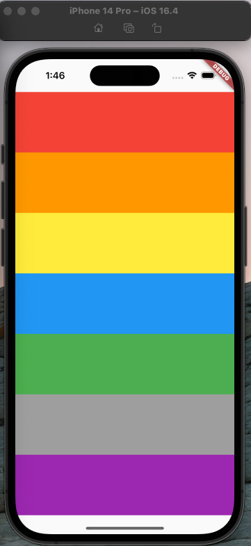

#Xylophone App

## Getting Started
This project is a simple application to practice using self define function and using public packages.
The app will allow user play 7 notes of 1 octacle

# Application Widget tree
The application widgets tree is simple as following.
